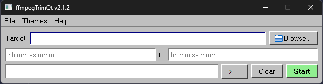

# FFmpegTrimQt



## General

A small script written in Python to solve my own problems, which grew in scale to be more useful to others, so I wrote a GUI.

I was unhappy with the built-in Windows video player trimmer, since it exported in 720p60 regardless of the source file's quality. This attempts to solve that problem by passing parameters to FFmpeg with specified settings, so that your clips will have exactly the parameters you want.

### Usage
Browse for a target file with the `Browse...` button, then enter the start and end timestamps of the original video to quickly trim it.

If the exported clip has a file extension of `*.mp4`, `*.mov`, or `*.m4a`, the flags for web-optimized video are automatically added (`-movflags +faststart`).

The timecode format can be whatever FFmpeg allows, including `HH:MM:SS.mmm`, `HH:MM:SS`, `MM:SS`, etc.

### Configuration
The release generates a `config.ini` with some default settings on first launch. You may modify these settings as you see fit.

You may also style the application however you wish via Qt's `.qss` stylesheets, located in the `themes` directory. Simply specify the theme you want the application to use by default in `config.ini`.

The included themes were shamelessly AI-generated. I don't have the time to create a theme by hand, and they're good enough by my standards.

You can also view the console to see detailed encoding progress by clicking the `>_` button.

### Future updates
While this is a fully functional application, there are still some things I wish to add, such as a proper icon and the ability to stop an encode midway through.

These are all small features, and any collaboration is welcome if there is something that should be added.

### Extra information
Included in the src directory is ffmpegTrim-cli.py, which is the original version of this script. However, it is not required to build the GUI application and is included simply for posterity/historical purposes.

## Building
### Requirements
- Python 3.12+

If you wish to build from source, clone the repository and run the following commands from the repository's root directory:

```bash
python -m venv .venv
.venv\Scripts\activate
pip install -r requirements.txt
pyinstaller FFmpegTrimQt.spec
```

The resulting executable will be placed in the dist directory.

You may choose not to copy over the themes directory and use your own copy of FFmpeg if desired. Simply place it in the ffmpeg directory next to the application.